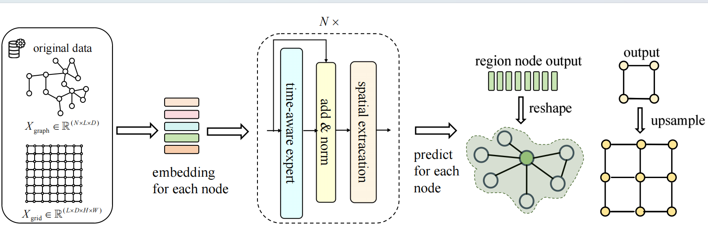
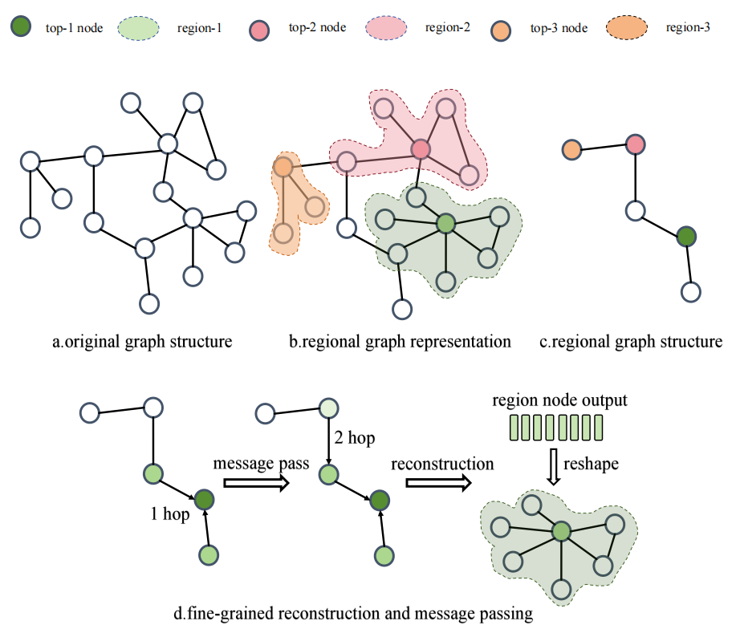
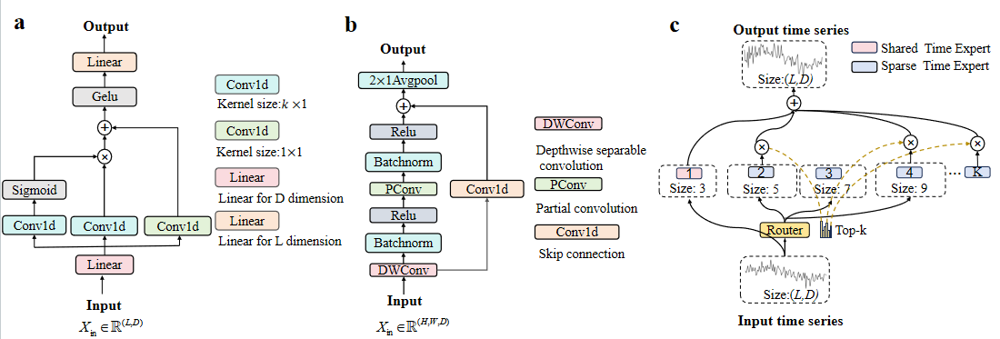

# Adaptable Graph Region for Optimizing Performance in Dynamic System Long-term Forecasting via Time-Aware Expert

## Project Overview

Real-time and accurate prediction of the long-term behavior of dynamic systems is crucial for identifying risks during unexpected events, while computational efficiency is significantly influenced by the scale of the dynamic system. However, existing neural network models mainly focus on optimizing network structures to improve accuracy, neglecting computational efficiency. To address this issue, we propose regional graph representation, which reduces the scale of the graph structure by merging nodes into region, extracting topological information through graph convolution or lightweight convolution modules, and restoring the regions via fine-grained reconstruction. Notably, this method is adaptable to all graph-based models. Meanwhile, we introduce a sparse time-aware expert module, which selects experts for processing different scale information through a dynamic sparse selection mechanism, enabling multi-scale modeling of temporal information. The architecture we achieve an optimal balance between speed and prediction accuracy, providing a practical solution for real-time forecasting..

 <!-- Insert your image path here -->

## Regional Graph Representation
Graph convolution operations inherently introduce an inductive bias, assuming that a node's features are primarily influenced by its neighboring nodes. Based on this assumption, we introduce a novel strategy: the neighbors of a node are pre-aggregated, with the node itself serving as the central hub of a region, 

## Model Parameters
Below are the model parameters:

'''
{
  "embed_dim": 64,
  "hidden_dim": 64,
  "out_dim": 4,
  "in_len": 36,
  "out_len": 36,
  "num_head_for_time": 8,
  "num_head_for_node": 8,
  "num_moe_layer": 3,
  "num_expert": 5,
  "top_k": 3,
  "att_mode": "linear",
  "activation": "relu",
  "is_fusion": true,
  "num_blocks": 2,
  "embedding_choose": "Traffic",
  "lr": 3e-3,
  "split_ratio": [0.6, 0.1, 0.3],
  "batch_size":64,
  "epoch": 50,
  "vehicle_dim": 4,
  "weather_dim": 1,
  "bridge_dim": 6,
  "pier_dim": 3,
  "traffic_dim": 1,
  "span": [5, 4, 3],
  "train": [3],
  "is_region":  true,
  "representation": "graph",
  "partial_ratio": 0.5,
  "num_longitude": 384,
  "num_latitude": 512,
  "region_order": 1,
  "patience":  5
}
'''

## Detail Implementatino of Module 
the time expert consists of two linear layers and one convolutional module. Its workflow is as follows: first, the feature dimensions are projected via the linear layer; then, gating convolution is used to extract temporal dimension information; finally, the linear layer is employed to aggregate the temporal dimensions. The time-aware expert includes two types of experts: shared experts and sparse experts. The shared expert is a mandatory module for all inputs, while sparse experts are dynamically allocated by the router to control the contribution weights of each expert in the model.
 

## Running Instructions
Run the run_this.py file. You can select different datasets through the embedding_choose parameter and choose different graph region orders using the region_order parameter.
All model run results, saved models, and relevant training curves will be stored in the corresponding loss folder, with each model having its own dedicated subfolder for storage.
You can use the is_region parameter to decide whether to enable regional graph representation, and adjust the region_order parameter to control the size of the regions.
## Application Areas
- Intelligent Transportation: Real-time traffic prediction and traffic management optimization.
- Weather Forecasting: Accurate prediction of dynamic weather data.
- Energy Management: Optimizing energy distribution and predicting system load.
